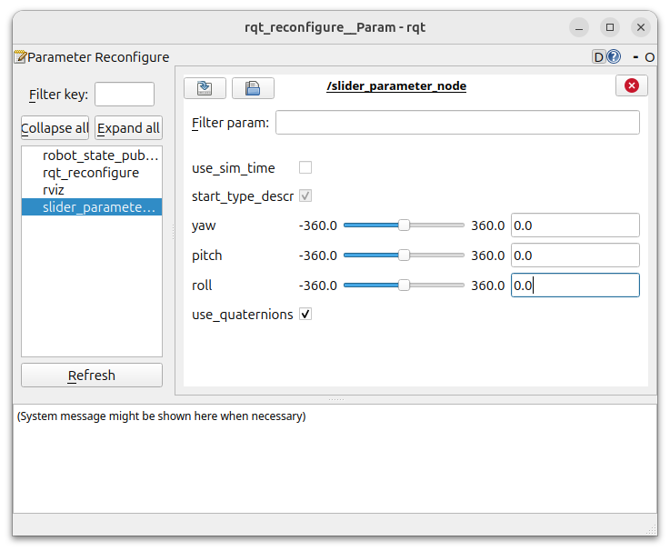
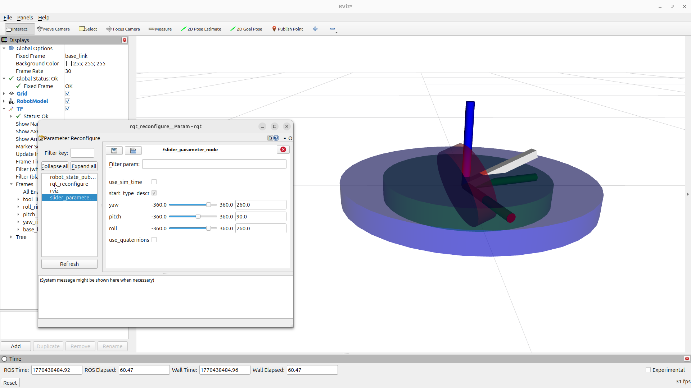
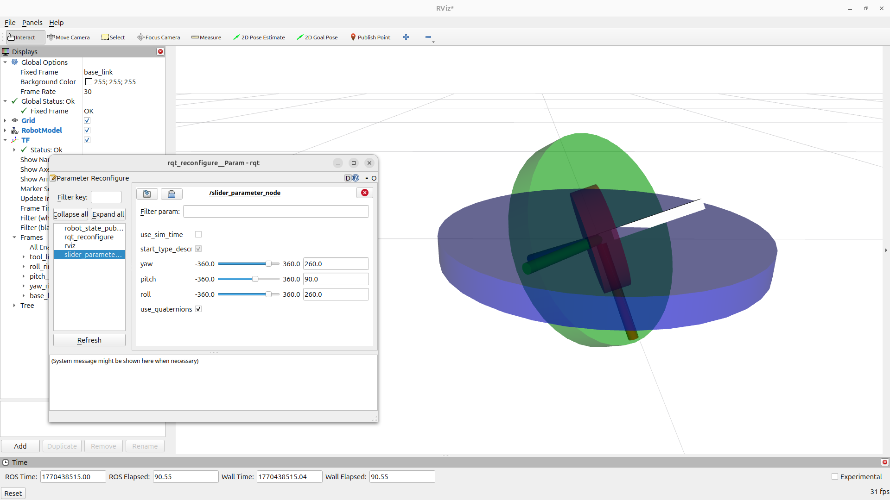

# Demonstrating Gimbal Lock with ROS URDFs
### Project 2: Intermediate ROS, tf2, URDFs, rviz, and creating your first complete project repository

### Michigan Tech EE5531 Intro to Robotics, February 6th, 2025

## About the package 
This package visualizes and controls a ROS URDF (Unified Robot Description Format) with a RQT slider to demonstrate the effect of [gimbal lock](https://en.wikipedia.org/wiki/Gimbal_lock) by controling rotational joint movement with euler angles and quaternions.

## Requirements

Please ensure the following packages are installed on Ubuntu 24.04 ROS2 Jazzy Instance:

```
$ sudo apt install ros-jazzy-robot-state-publisher
$ sudo apt install ros-jazzy-rqt-reconfigure
$ pip install scipy
```

## Instructions

In a ROS2 workspace, clone this repo package into the `ros2_ws/src/` directory, build, and source the workspace:

```
$ cd ~/ros2_ws/src/
$ git clone git@github.com:Robust-Autonomous-Systems-Laboratory/Project2_iqmattso.git
$ colcon build
$ source install/setup.bash
```

To start the node, launch the `gimbal_lock_demo.xml` launch file:
```
$ ros2 launch gimbal_lock_demo gimbal_lock_demo.xml
```

RViz will open a predefined configuration file, and an RQT window will open.  In the RQT window, click refresh to activate the 'slider_parameter_node' parameter slider window, shown in Figure 1:



<u>Figure 1:</u> Ensure only the 'slider_parameter_node' is selected (highlighted in blue on the left column), and drag the sliders to control the model's roll, pitch, and yaw.  Toggle the 'use_quaternions' button to switch from euler angle calculations to quaternion calculations to visualize gimbal lock.

__Note:__ The URDF model will not appear in RVIZ2 until one of the sliders is toggled, publishing the first JointState() message.


## Gimbal Lock Demonstration

To assist in visualizing the axes of rotation, a gyroscope-like URDF model is used, where three disks representing roll, pitch, and yaw and linked together. 

### Euler Angles
In Figure 2, the pitch of the gyroscope is set to 90 degrees, and the yaw and roll are set at 260 degrees.  The blue and green disks are locked together, indicating gimbal lock.




<u>Figure 2:</u> Pitch and yaw are locked together.


### Quaternions
In Figure 3, the pitch of the gyroscope is set to 90 degrees, and the yaw and roll are set to 260 degrees. The blue and green disks are *not* locked together, showing that using quaternions prevents axes locking up.




<u>Figure 3:</u> Pitch and yaw are not locked together.


## GenAI Disclosure

Google's Gemini AI was used to generate example syntax for setting up the rqt_reconfigure parameter sliders and accessing the slider values in the node. Also, it was used to assist in the URDF gyroscope model.

Prompts:
```
"Generate an example of a ROS2 RQT slider to adjust parameters in a Python node."
"How could I model a gyroscope in a ROS2 URDF file?"

```

